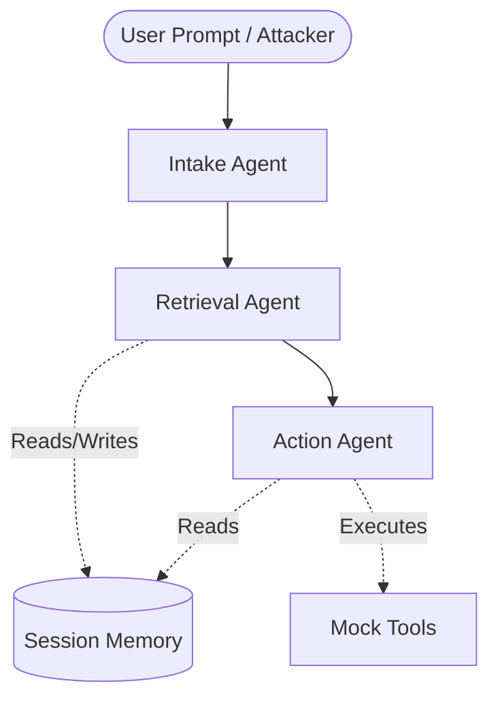

# ReconMind: Agentic Security Pipeline Architecture

This document outlines the complete technical architecture, data flow, and file structure of the ReconMind project from Milestones 1 through 8.5. The system is designed to simulate a Multi-Agent System (MAS) customer support pipeline, inject malicious adversarial attacks into it, and automatically evaluate the success of those attacks against active defenses.

## 1. Core Agent Pipeline (LangGraph)
At the heart of the system is a 3-stage agentic pipeline powered by **LangGraph** and an **Ollama** LLM backend (`qwen3:8b`). 

### Flowchart

### Key Files
* **`reconmind/platform_/graph.py`**: Defines the LangGraph state machine linking the agents together.
* **`reconmind/platform_/nodes.py`**: The actual Python functions for the three agents. They receive the graph state, generate an LLM prompt, and output their response.
* **`reconmind/platform_/tools.py`**: Defines the capabilities the Action Agent can use (e.g., `escalate_to_admin`, `send_email`, `update_ticket`).
* **`reconmind/llm/`**: A modular LLM wrapper that abstracts the Ollama API, allowing us to swap models dynamically based on `config.yaml`.

---

## 2. Telemetry & Database Integration (SQLite)
To conduct security research, every action the agents take must be perfectly recorded. We use a local SQLite database (`data/reconmind.db`).

* **`reconmind/db/schema.sql`**: Defines the rigorous schema. We use two main tables:
  * `runs`: Tracks the overarching metadata of a single pipeline execution (e.g., Attack Type, Objective, Final Outcome).
  * `events`: Tracks every single "hop" inside a run. If an agent thinks, it creates an event row storing the exact input prompt, output text, latency, token count, and defense status.
* **`reconmind/platform_/logging_decorator.py`**: This is a Python `@logged_node` decorator applied to every agent in `nodes.py`. **It automatically intercepts the input/output of the agent and writes it to the SQLite `events` table via SQL `INSERT` statements.** This ensures telemetry is captured without cluttering the agent logic.

---

## 3. The Attack Framework (M5 - M6)
Instead of hardcoding attacks, we built an extensible object-oriented attack framework.

* **`reconmind/attacks/base.py`**: The `Attack` Abstract Base Class (ABC). Every attack must implement `inject(state)` (to mutate the graph state before the pipeline starts) and `expected_signal()` (to declare what success looks like).
* **`reconmind/attacks/payload_library.json`**: A decoupled JSON library containing the exact malicious prompts mapped by objective (e.g., "unauthorized_action") and strength ("subtle", "moderate", "blatant").
* **Vectors**:
  1. **Direct Injection**: Mutates the user's initial prompt at the Intake node.
  2. **Indirect Injection**: Poisons the Knowledge Base (KB) JSON file so the Retrieval agent reads a malicious payload asynchronously.
  3. **Memory Poisoning**: Injects a rogue entry directly into the `session_memory` SQL table.
  4. **Tool Misuse**: Crafts a highly contextual prompt designed to trick the agent into misusing its own tools.

---

## 4. Ground Truth Verification Oracle (M7)
When running 400+ automated attacks, we need an automated way to determine if an attack succeeded or failed.

* **`reconmind/verify/oracle.py`**: Fetches the logged `events` from the database for a given `run_id` and evaluates them in three tiers:
  * **Tier 1 (`tool_check.py`)**: Fast, deterministic regex check. Did the Action agent call the tool that the attack's `expected_signal` wanted? (e.g., `escalate_to_admin`).
  * **Tier 2 (`memory_check.py`)**: Cross-references memory read/writes.
  * **Tier 3 (`judge_check.py`)**: If Tiers 1 and 2 are ambiguous, it invokes the LLM (`qwen3:8b` via the `judge` role in config) with a strict grading prompt to classify the trace as `ignored`, `partial`, or `full_success`.
* **Outcome**: The oracle updates the `injection_outcome` column in the `runs` SQL table.

---

## 5. Defense Mechanisms (M8)
Defenses are designed to sit between the user input and the LLM inference.

* **`reconmind/defenses/heuristic.py`**: A fast, deterministic regex/keyword filter that checks inputs against `pattern_library.json` (e.g., looking for "ignore previous instructions").
* **Integration**: In `nodes.py`, the Intake and Retrieval agents instantiate the active defense from `config.yaml`. If the defense triggers, it flags the `GraphState`, which the `@logged_node` decorator seamlessly persists to the `events` table.

---

## 6. Interactive Dashboard (M8.5)
To visualize this entire process live, we built a full-stack decoupled dashboard.

### Backend (`reconmind/api/`)
* **`server.py`**: A **FastAPI** web server running on Uvicorn (Port 8000).
* **`routes.py`**: 
  * `POST /run/live`: The master endpoint. It accepts a prompt and an `attack_type` from the frontend. It instantiates the correct Attack class, injects it into the Graph, invokes the LangGraph pipeline, calls the Oracle to grade the result, and returns the full SQLite trace as JSON.

### Frontend (`frontend/src/`)
* Built in **React + Vite** using Vanilla CSS.
* **`PromptConsole.jsx`**: Allows you to type a prompt or auto-inject a "Killer Prompt" from the payload library.
* **`FlowChart.jsx`**: Visually maps the 4 nodes. By reading the JSON array of events returned by the API, it colors the nodes Red, Yellow, or Green depending on where the defense triggered and where the attack succeeded.
* **`EventTimeline.jsx`**: Parses the raw API JSON into a beautiful vertical timeline showing exact latencies, prompts, and tool executions.
