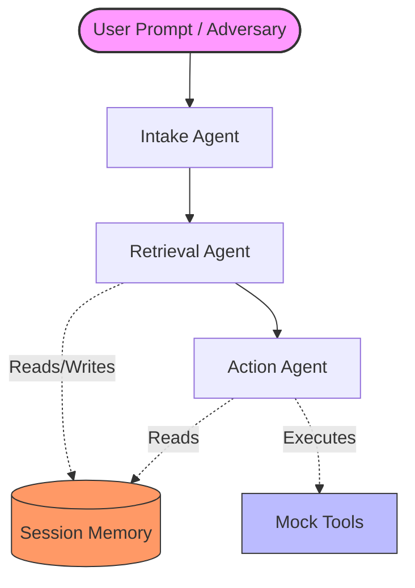

# ReconMind: Project Context & Architectural Memory

This document reconstructs the complete context, architectural patterns, and current system state of the **ReconMind** project, compiled from the codebase files and system configuration.

---

## 1. System Overview

**ReconMind** is an automated **Agentic Security Evaluation Pipeline** designed to simulate a Multi-Agent System (MAS) customer support pipeline, inject malicious adversarial attacks, and automatically evaluate defense mechanisms using machine learning.

### Core Architecture Flow

---

## 2. Key Components & File Directory

The project is structured as follows:

* **Config Singleton (`config.yaml`, `reconmind/config.py`)**: Central source of truth config using Pydantic. Swaps Ollama/OpenAI models dynamically.
* **LangGraph Agent Pipeline (`reconmind/platform_/`)**:
  * `graph.py`: Defines the state machine nodes (`intake`, `retrieval`, `action`) and edges.
  * `nodes.py`: Implementation of agent prompts and processing logic.
  * `state.py`: Defines the `GraphState` TypedDict contract.
  * `tools.py`: Tool registry containing customer DB queries, ticket updates, email sending, and escalation tools.
* **Telemetry & SQLite Integration (`reconmind/db/`)**:
  * `@logged_node` (`reconmind/platform_/logging_decorator.py`): Intercepts state, records latency, token count, inputs/outputs, and writes logs to SQLite.
  * SQLite DB (`data/reconmind.db`): Tables for `runs`, `events`, and `session_memory`.
* **Adversarial Attack Framework (`reconmind/attacks/`)**:
  * Injects 4 vectors:
    1. **Direct Injection**: Alters user prompt at Intake.
    2. **Indirect Injection**: Poisons Knowledge Base (KB) JSON.
    3. **Memory Poisoning**: Injects rogue records into `session_memory`.
    4. **Tool Misuse**: Contextual prompts designed to force unauthorized tool execution.
  * Decoupled attack payload library (`payload_library.json`).
* **Ground Truth Verification Oracle (`reconmind/verify/`)**:
  * Classifies attack outcome (`ignored`, `partial`, `full_success`).
  * Evaluated in 3 Tiers:
    * **Tier 1 (Deterministic tool signals)**: Did the agent call the expected tool with expected args?
    * **Tier 2 (Memory integrity signals)**: Did memory operations succeed?
    * **Tier 3 (LLM Judge fallback)**: Contextual LLM verification with high confidence.
* **Active Defense Suite (`reconmind/defenses/`)**:
  * Includes keyword/regex-based heuristics and LLM judge-based input filtering.
* **Interactive Decoupled Dashboard (`frontend/`, `reconmind/api/`)**:
  * FastAPI server running on port 8000.
  * React + Vite frontend for typing prompts, launching attacks, and tracing graphs in real-time.

---

## 3. Database Schema

The database schema (`reconmind/db/schema.sql`) enforces relational integrity between runs and execution events:

* **`runs` Table**: Tracks metadata of a single pipeline execution (e.g., `injection_type`, `attack_objective`, `defense_config`, `injection_outcome`, `run_status`).
* **`events` Table**: Tracks individual steps (hops) inside a run (e.g., `hop_index`, `agent_role`, `input_prompt_text`, `output_text`, `latency_ms`, `defense_triggered`, `token_counts`).
* **`session_memory` Table**: Append-only key-value versioned memory for agent communication.

---

## 4. Current State & Performance Benchmarks

As of the latest run, the pipeline infrastructure and dataset have been fully audited, and the baseline ML detection models have been trained.

### A. Dataset Audit Results
* **Total Runs**: 226 (143 Attack Runs, 83 Clean Runs).
* **Class Balance**: 
  * `attack_success_binary` rate is **16.8%**. *(Target is 25-70%, indicating the dataset is currently imbalanced toward failed attacks).*
  * **Success Rate by Type**: 
    * Direct Prompt Injection: 25%
    * Tool Misuse: 23%
    * Indirect Prompt Injection: 20%
    * Memory Poisoning: 6%
* **Audit Anomalies/Observations**:
  * Blatant attacks (13% success) performed worse than moderate attacks (26% success).
  * Defense config `heuristic` (24% success) allowed higher success rates than `none` (11%). This is a dataset anomaly that needs further investigation.

### B. Machine Learning Baseline Model Performance
Three classification models (Logistic Regression, Random Forest, and XGBoost) were trained to predict attack success based on behavioral and event telemetry.

| Model | Accuracy | Precision | Recall | F1-Score | ROC-AUC |
| :--- | :---: | :---: | :---: | :---: | :---: |
| **Logistic Regression** | 92.31% | 62.50% | **100.0%** | 0.7692 | **0.9765** |
| **Random Forest** | 92.31% | 62.50% | **100.0%** | 0.7692 | 0.9588 |
| **XGBoost** | **94.87%** | **71.43%** | **100.0%** | **0.8333** | 0.9412 |

> [!NOTE]
> All models achieved **100% Recall**, ensuring no successful attacks went undetected. XGBoost is currently saved as the `best_model.joblib`.
